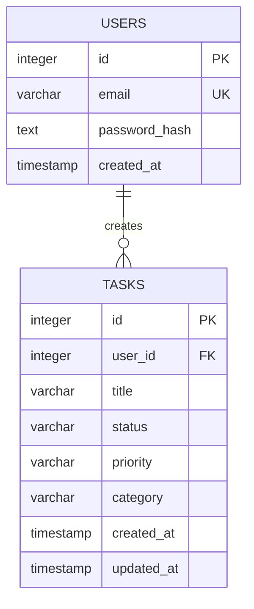

# ER-модель базы данных AI Task Assistant

## Описание

База данных проекта состоит из двух основных сущностей:

- User — пользователь системы
- Task — задача пользователя

Связь между сущностями:

- один пользователь может иметь много задач;
- каждая задача принадлежит только одному пользователю.

Тип связи:

```text
User 1 → N Task
```

## ER-диаграмма



## Сущность USERS

Таблица `users` хранит данные пользователей.

| Поле | Тип | Описание |
|---|---|---|
| id | integer | Уникальный идентификатор пользователя |
| email | varchar | Email пользователя, используется для входа |
| password_hash | text | Хеш пароля пользователя |
| created_at | timestamp | Дата регистрации пользователя |

Ограничения:

- `id` является первичным ключом;
- `email` должен быть уникальным;
- `password_hash` обязателен.

## Сущность TASKS

Таблица `tasks` хранит задачи пользователей.

| Поле | Тип | Описание |
|---|---|---|
| id | integer | Уникальный идентификатор задачи |
| user_id | integer | Идентификатор пользователя, которому принадлежит задача |
| title | varchar | Название или текст задачи |
| status | varchar | Статус задачи |
| priority | varchar | Приоритет задачи |
| category | varchar | Категория задачи |
| created_at | timestamp | Дата создания задачи |
| updated_at | timestamp | Дата последнего обновления задачи |

Ограничения:

- `id` является первичным ключом;
- `user_id` является внешним ключом;
- `user_id` ссылается на `users.id`;
- `status` может принимать значения: `todo`, `in_progress`, `done`;
- `priority` может принимать значения: `low`, `medium`, `high`.

## Связь USERS и TASKS

Связь между таблицами:

```text
users.id → tasks.user_id
```

Это означает:

- один пользователь может создать много задач;
- каждая задача принадлежит только одному пользователю;
- пользователь видит только те задачи, где `tasks.user_id` равен его `users.id`.

При удалении пользователя его задачи также удаляются.